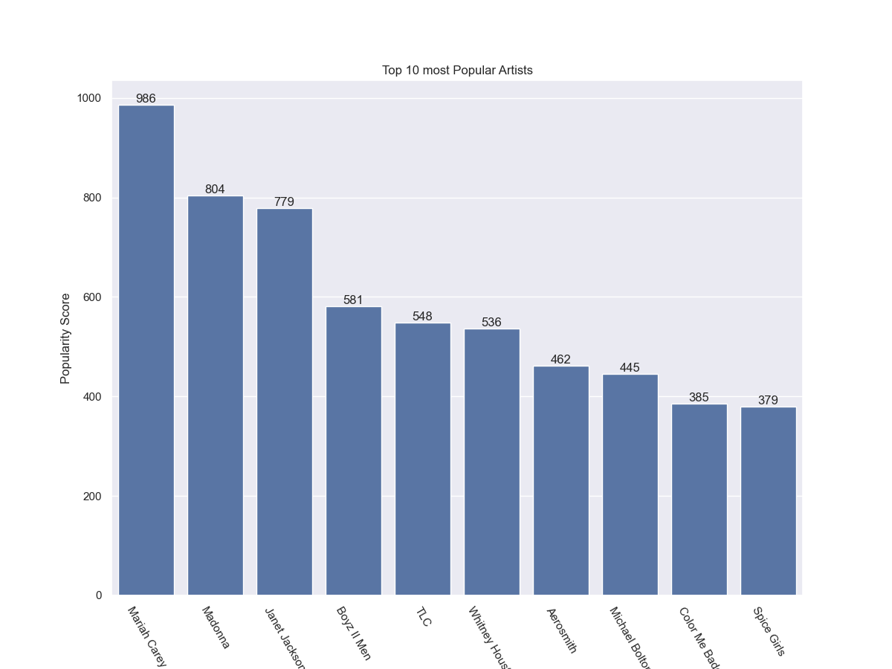

<h1 align="center">Classic Hits Analysis</h1>

<!-- TABLE OF CONTENTS -->

## Table of Contents

- [Overview](#overview)
- [Tools](#tools)
- [Contact](#contact)

<!-- OVERVIEW -->

## Overview

In this project I analysed one of the trending datasets on [Kaggle](<https://www.kaggle.com>) about Classic Hits from the 1990s. The Classic Hits dataset from kaggle with Python which had 980 iconic 1990s singles performed by 536 different artists. Each track in the collection includes full Spotify audio feature data, allowing for in-depth analysis of musical properties like danceability, key, length, etc. The link to the dataset can be found [here](https://www.kaggle.com/datasets/thebumpkin/1990s-classic-hits-with-spotify-data).

## Tools

- [Pandas](https://pandas.pydata.org)
- [Matplotlib](https://matplotlib.org)
- [Plotly](https://plotly.com/)
- [Seaborn](https://seaborn.pydata.org)

## Contact

- GitHub [@Sotun-1010](https://github.com/Sotun-1010)
- Twitter [@O_G_Sotun](https://twitter.com/O_G_Sotun?t=kRiO1YNhYKn8NJJnxTZ42A&s=03)
- Portfolio Site [Ogunjirin Oluwasotun](https://www.datascienceportfol.io/oluwasotunogunjirind)
- Medium [Ogunjirin Oluwasotun Goodness](https://medium.com/@oluwasotunogunjirin)